# Budget-365

## Description
Mobile app designed to allow for collaboration on making and reporting monthly budgets, incomes, and expenses 

## Usage
To use the app in the current configuration please create a brand new account or use the one provided below. I recommend you use the account though for the best view of the project

### Login that has stuff going on

Email: jamesmata556@gmail.com

Password: 123456

#### Alternatively Join Group With Code

Code: BXYZ

## New Additions to the final version

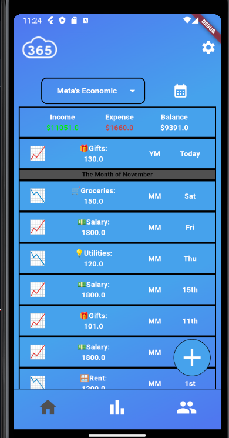

The home screen got a ui rework to fit the data better

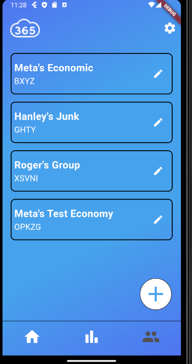

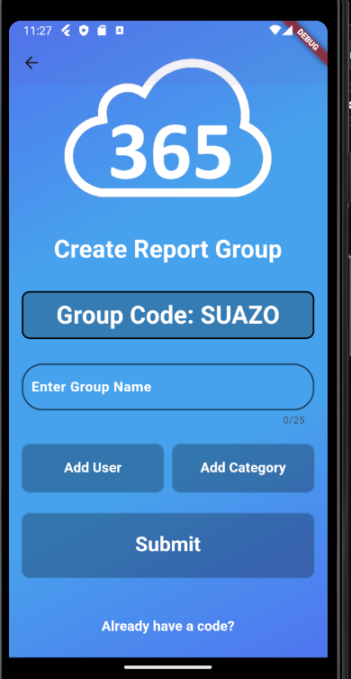

Groups have now been added for everyone to use, you can edit, join, and create new groups

There's also now a settings page to log out, export data, send report email and set preferences

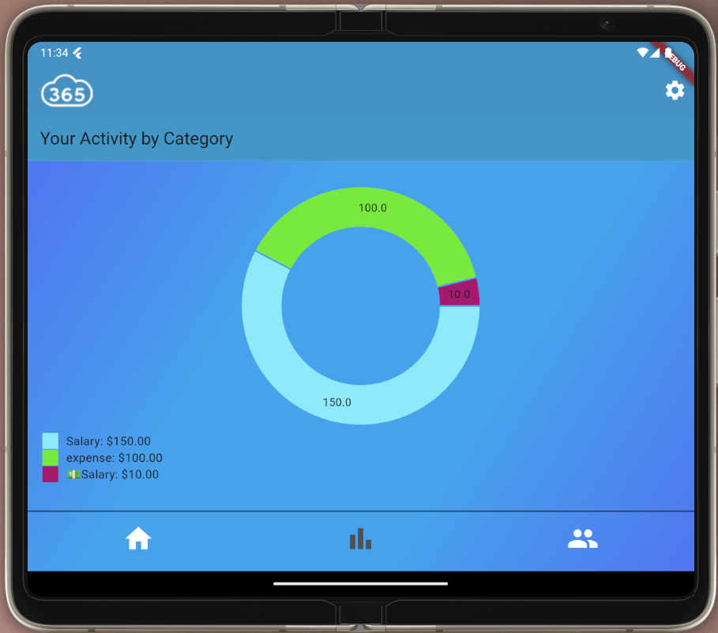

There's also now basic data visualization for reports

## Required Features:

### Dialogs and pickers:
Can be seen if logged in as my account and you navigate to the reports section and you click on the date text field

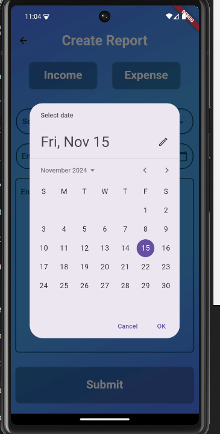

### Multiple Screens and navigation:
This can be seen in the many different screens you can navigate to 

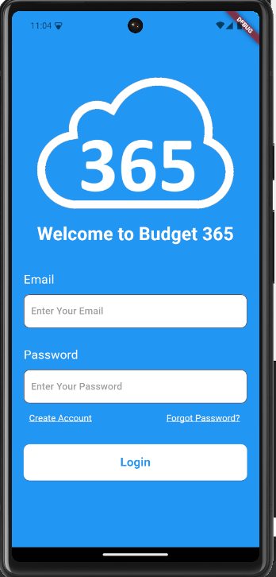

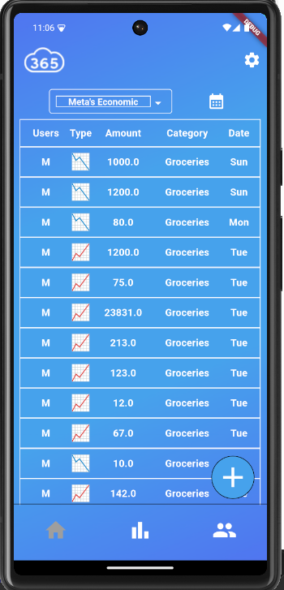

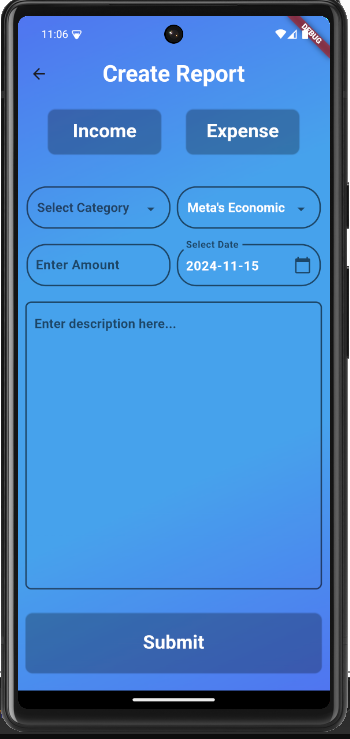

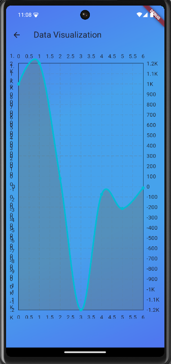

### Snack Bars:
This can be seen after you submit a report to the database

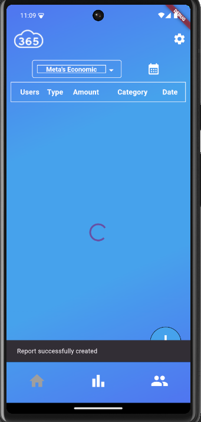

### Notifications:
Notifications are no longer absent because Dennis is great

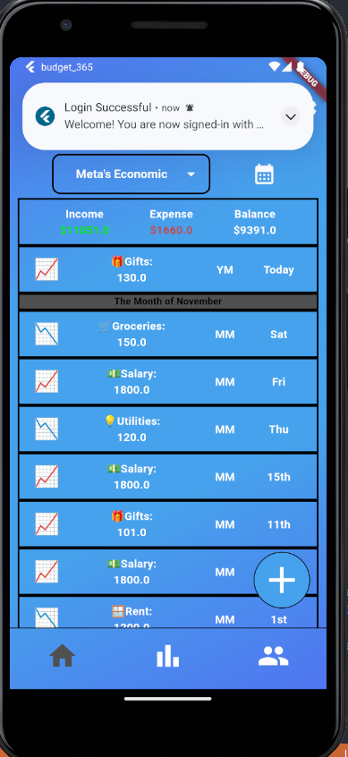

### Local Storage:
This can be seen after your first login, whenever you boot up the app it automatically signs you in instead of requiring you to login each time

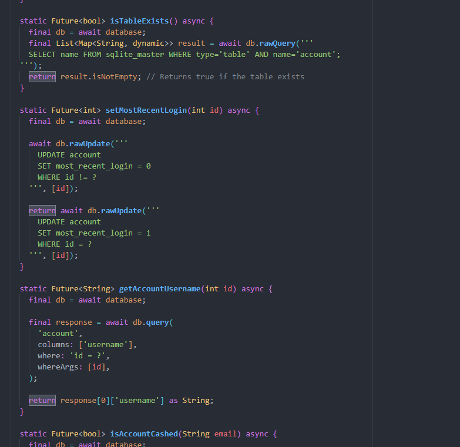

### Cloud Storage:
This can be seen in the reports as they are all stored on a cloud database

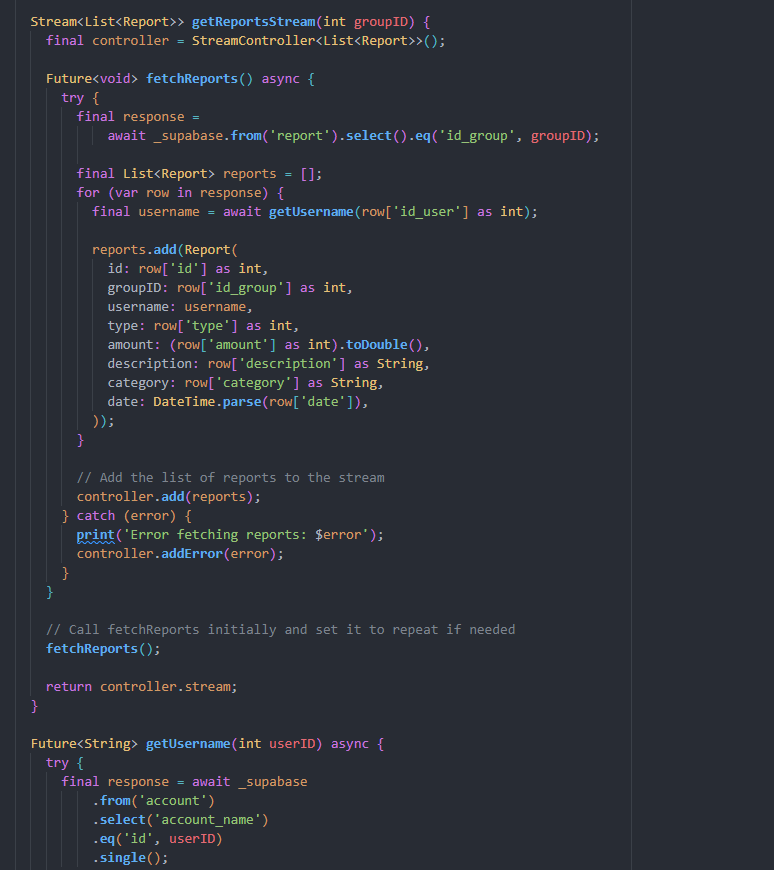

### HTTP Request:
This can be seen in our calls to our supabase client as they all use HTTP requests inorder to operate

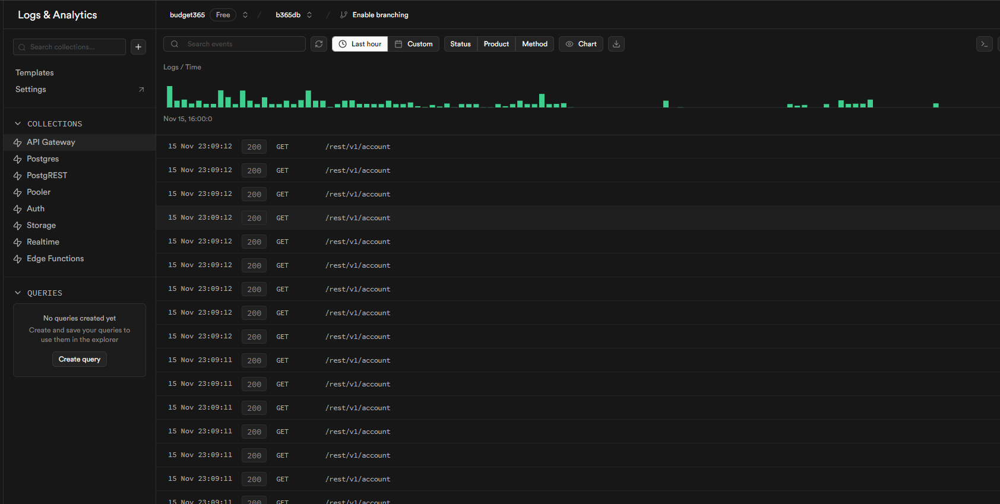
